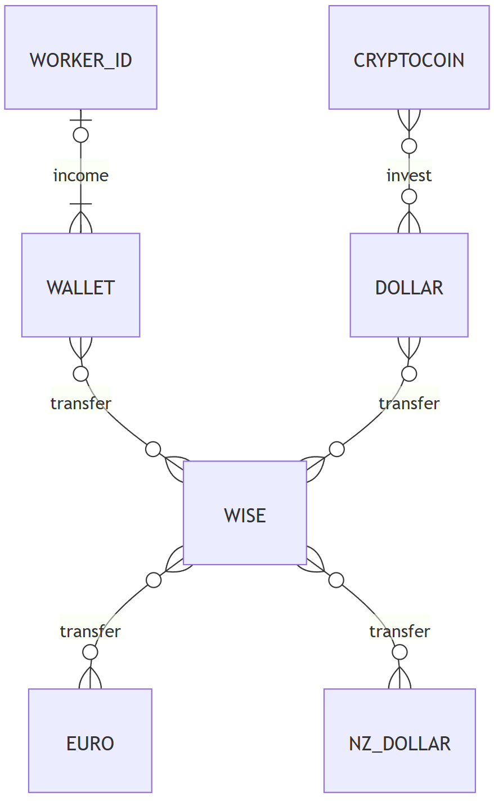

# Design Document

By Matheus Norberto Hagemann

Video overview: <https://youtu.be/jtvHjMkEot8>

**  Name  project: Currency Transfer

## Scope

In this section you should answer the following questions:

* What is the purpose of your database?
The purpose of this database is to track money (investment, movements, expenditures) to
organize personal expenditures.

* Which people, places, things, etc. are you including in the scope of your database?
Professional (workers) and international bank account, including TransferWise to  convert
the currencies. And investment account as cryptocurrency.

* Which people, places, things, etc. are *outside* the scope of your database?
From the scratch it was designed to improve/assist works balances, so it
wouldn't include other people (although it would be possible with a little adaptation
maybe in the version 2.0 ;))

## Functional Requirements

In this section you should answer the following questions:

* What should a user be able to do with your database?
Track and control expenditures (you control what you track correct :)). Check investments.
Monitor amount in certain currencies, example (if you want to travel to New Zealand you
can send monthly some amount to NZ bank, so you will have a travel plan).

* What's beyond the scope of what a user should be able to do with your database?
This version count only with the national currency of the user (in this case BRL), and
the foreign currencies: Dollars, New Zealand Dollars, Euros, and Crypto coin, it does not
have further coins.

## Representation

Entities are captured in SQLite tables with the following schema;

### Entities

In this section you should answer the following questions:

* Which entities will you choose to represent in your database?
* What attributes will those entities have?
* Why did you choose the types you did?
* Why did you choose the constraints you did?

The table "worker"  includes:

** "id" --> Which is the unique ID of this table of the worker that is registered in the database.
It is also the "PRIMARY KEY' of this table. It has the "INTEGER" format.
** "first_name" --> Which is the unique Name of the worker registered in the database.
It has the "TEXT" format, and cannot be null, that means "NOT NULL" is applicable.
** "last_name" --> Which is the unique Last Name (surname) of the worker registered in the database.
It has the "TEXT" format, and cannot be null, that means "NOT NULL" is applicable.

The table "wallet" includes:
** "id" --> Which is the unique ID of this table of the worker that is registered in the database.
It is also the "PRIMARY KEY' of this table. It has the "INTEGER" format.
** "worker_id" --> Which is the ID that references to the "worked_id" table.
It is also a "SECONDARY KEY' of this table. It has the "INTEGER" format.
** "wise_id" --> Which is the ID that references to the "Wise" table.
It is also a "SECONDARY KEY' of this table. It has the "INTEGER" format.
** "balance" --> Which is the Amount of money that the account holds.
It has the "REAL" format.
** "transfer_date" --> Which is the date and time that an transfer occurs.
It has  the "NUMERIC" format, is "NOT NULL". The CURRENT_TIMESTAMP has
the standard format: YYYY-MM-DD HH:MI:SS

The "wise" table is the main table of the database, and includes:
** "id" --> Which is the unique ID of this table of the worker that is registered in the database.
It is also the "PRIMARY KEY' of this table. It has the "INTEGER" format.
** "currency" --> Which is the Currency(ies) that the account  hold, and that can be (e.g. EURO, Dollar,
NZ Dollar, BRL, etc..). It has the "TEXT" format, and cannot be null, that means "NOT NULL" is applicable.
** "coin_prices" --> Which is the Price to convert one currency to another (it variates with time).
It has the "REAL" format.
** "transfer_fee" --> Which is the Fee paid on each exchange. It has the "REAL" format.
** "deposit" Which is the amount the is Deposited in the account (in a specific currency).
It has the "REAL" format.
** "draw" Which is the amount the is Draw in the account (in a specific currency).
It has the "REAL" format.
** "balance" Which is the amount of a specific currency in the account.
It has the "REAL" format.
** "date" --> Which is the date and time that an transfer occurs.
It has  the "NUMERIC" format, is "NOT NULL". The CURRENT_TIMESTAMP has
the standard format: YYYY-MM-DD HH:MI:SS
** "euro_id" --> Which is the ID that references to the "euro" table.
It is also a "SECONDARY KEY' of this table. It has the "INTEGER" format.
** "dollar_id" --> Which is the ID that references to the "dollar" table.
It is also a "SECONDARY KEY' of this table. It has the "INTEGER" format.
nz_dollar_id --> Which is the ID that references to the "nz_dollar" table.
It is also a "SECONDARY KEY' of this table. It has the "INTEGER" format.

The table "euro" includes:
** "id" --> Which is the unique ID of this table of the worker that is registered in the database.
It is also the "PRIMARY KEY' of this table. It has the "INTEGER" format.
** "balance" --> Which is the amount available  in the account. It has the "REAL" format.
** "transfer_date" --> Which is the date and time that an transfer occurs.
It has  the "NUMERIC" format, is "NOT NULL". The CURRENT_TIMESTAMP has
the standard format: YYYY-MM-DD HH:MI:SS

The table "dollar" includes:
** "id" --> Which is the unique ID of this table of the worker that is registered in the database.
It is also the "PRIMARY KEY' of this table. It has the "INTEGER" format.
** "balance" --> Which is the amount available  in the account. It has the "REAL" format.
** "transfer_date" --> Which is the date and time that an transfer occurs.
It has  the "NUMERIC" format, is "NOT NULL". The CURRENT_TIMESTAMP has
the standard format: YYYY-MM-DD HH:MI:SS
** "crypto_id" --> Which is the ID that references to the "crypto" table.
It is also a "SECONDARY KEY' of this table. It has the "INTEGER" format.

The table "nz_dollar" includes:
** "id" --> Which is the unique ID of this table of the worker that is registered in the database.
It is also the "PRIMARY KEY' of this table. It has the "INTEGER" format.
** "balance" --> Which is the amount available  in the account. It has the "REAL" format.
** "transfer_date" --> Which is the date and time that an transfer occurs.
It has  the "NUMERIC" format, is "NOT NULL". The CURRENT_TIMESTAMP has
the standard format: YYYY-MM-DD HH:MI:SS

The table "crypto" includes:
** "id" --> Which is the unique ID of this table of the worker that is registered in the database.
It is also the "PRIMARY KEY' of this table. It has the "INTEGER" format.
** "deposit" --> Which is the amount the is Deposited in the account (in a specific currency).
It has the "REAL" format.
** "draw" --> Which is the amount the is Draw in the account (in a specific currency).
It has the "REAL" format.
** "balance" --> Which is the amount of a specific currency in the account.
It has the "REAL" format.
** "return" --> Which is the profit or loss the investment had. It has the "REAL" format.
** "transfer_date" --> Which is the date and time that an transfer occurs.
It has  the "NUMERIC" format, is "NOT NULL". The CURRENT_TIMESTAMP has
the standard format: YYYY-MM-DD HH:MI:SS

### Relationships

The below entity relationship diagram describes the relationships among the entities in the database.

Follow the Entity Diagram code;
"
https://mermaid.js.org/syntax/entityRelationshipDiagram.html
---
title: TransferWise
---
erDiagram
    WISE }o--o{ EURO : transfer
    WISE }o--o{ NZ_DOLLAR : transfer
    WORKER_INCOME |o--|{ WALLET : income
    WALLET }o--o{ WISE : transfer
    DOLLAR }o--o{ WISE : transfer
    CRYPTOCOIN }o--o{ DOLLAR : invest

(zero) Many-to-many relation ship: }o--o{
"
Explanation:
One (WORKER_INCOME) can have many "incomes" to his/her (WALLET) but a WALLET has can have maximum one owner
(the WORKER).
One (WALLET) can send zero or many transfers to (WISE) as well (WISE) can send zero or many transfers to (WALLET).
One (WISE) account can send zero or many transfers to (EURO, DOLLAR, or NZ_DOLLAR), as well (EURO, DOLLAR, or NZ_DOLLAR) accounts can send zero or many transfer to (WISE).
One (DOLLAR) account can send zero or many transfers to (CRYPTOCOIN), as well (CRYPTOCOIN) accounts can send zero or many transfer to (DOLLAR).

## Optimizations

In this section you should answer the following questions:

* Which optimizations (e.g., indexes, views) did you create? Why?

It was created the index bellow since the JOIN function might be used many times to search for the name, surname  of  the account holders:
CREATE INDEX "worker_id_search" ON "wallet" ("worker_id");

It was created the indexes bellow to speed the search on each specific coin in the wise table, that is the main table that allows the currency exchange:
CREATE INDEX "euro_id_search" ON "wise" ("euro_id");
CREATE INDEX "dollar_id_search" ON "wise" ("dollar_id");
CREATE INDEX "nz_dollar_id" ON "wise" ("nz_dollar_id");

## Limitations

In this section you should answer the following questions:

* What are the limitations of your design?
It was designed to show the flow of the money received by the workers taking into consideration that it starts from WORKER_INCOME to WALLET.

* What might your database not be able to represent very well?
As per example of the limitation above described, it would be difficult to represent an input/deposit from an external source to the banks other than WALLET (as DOLLAR, WISE, EURO, NZ_DOLLAR), because it was designed to have exchange between them. So for example if the worker make a freelance job in Europe and received in euro it would not represent well in my point of view (tough it is possible to represent).
